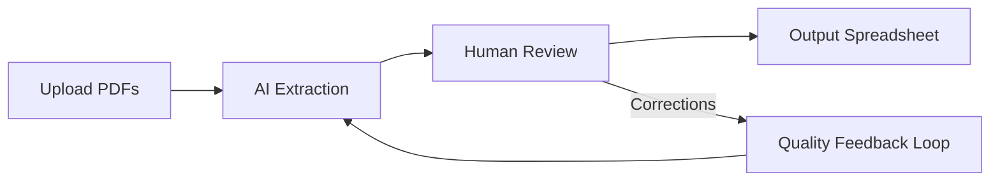

# Technical Documentation Skill

Create concise, high-quality technical documentation as Markdown files. The goal is documents that a developer or stakeholder can scan quickly, find what they need, and act on — not walls of text.

## Core Principles

These principles should guide every document you produce. They're drawn from what makes technical docs actually useful in practice:

**Lead with the "so what."** Every document opens with a summary that tells the reader what this is, why it matters, and what the key takeaway is. If someone reads only the first section, they should understand the document's purpose and conclusion.

**Be concrete, not abstract.** Use real file paths, function names, config values, metrics, and code snippets. Vague descriptions like "the system processes data efficiently" are useless — say "processes ~41 cases/month at $2.11/case AI cost."

**Tables over prose for structured data.** Whenever you're comparing options, listing metrics, showing status, or presenting any data with multiple dimensions, use a Markdown table. Don't bury numbers in paragraphs.

**Earn every sentence.** If a sentence doesn't add information the reader needs, cut it. Technical docs aren't essays — readers are scanning for answers, not reading for pleasure. Avoid filler phrases like "it is worth noting that" or "it should be mentioned that."

**Make it actionable.** End sections with what to do next, what the recommendation is, or what the tradeoffs are. Passive observation without guidance wastes the reader's time.

## Document Structure

Every technical document follows this general skeleton. Not every section applies to every document — use judgment about which sections are relevant. The key structural rule is: **general → specific, context → detail, summary → evidence.**

```
# Title

**Metadata line** (date, author, status — one line, not a block)

---

## Executive Summary / Overview
What this is, why it exists, key conclusion or status.
2-5 sentences max. This is the "if you read nothing else" section.

---

## Body Sections
Organized by the document's natural structure (see Document Types below).
Use tables for data, code blocks for technical content, and concise prose
to connect them.

---

## Recommendations / Next Steps / Roadmap
What should happen as a result of this document.
```

### Metadata

Keep metadata to a single line or a tight block at the top. Don't create a sprawling header with fields nobody reads. Good:

```markdown
**Date:** 2026-03-10 | **Author:** Engineering | **Status:** Draft
```

### Length

Aim for the shortest document that fully covers the topic. As a rough guide: migration guides and ADRs tend to land around 80–150 lines, feasibility studies and project overviews around 150–250 lines, and detailed technical analyses around 200–300 lines. If a document exceeds 300 lines, consider whether it should be split into a summary document with links to companion deep-dives.

### Section Separators

Use horizontal rules (`---`) between major sections (between `##` headings). This gives the document visual breathing room and makes it easier to scan. Don't use them between subsections (`###`).

### Section Headings

Use `##` for major sections and `###` for subsections. Avoid going deeper than `####` — if you need more nesting, the document structure needs rethinking. Heading text should be scannable labels, not full sentences.

Good: `## Per-Carrier Comparison (Run 9 → Run 10)`
Bad: `## A Detailed Comparison of Results Between Run 9 and Run 10 Across All Carriers`

### Tables

Tables are your primary tool for structured information. Use them for:
- Metrics and KPIs
- Feature/option comparisons
- Status matrices (what's done, what's planned)
- Configuration references
- Effort estimates
- Change logs between versions

Keep tables readable — if a table has more than 6-7 columns, split it or reconsider the format.

### Code Blocks

Include code when it's the clearest way to show something. Always specify the language for syntax highlighting. Use code blocks for:
- Commands the reader needs to run
- Configuration snippets
- Code that illustrates a technical point
- File paths and directory structures

Don't include entire files — show the relevant excerpt with enough context to understand it, and reference the file path.

### Visuals

Use diagrams and charts when they communicate relationships or trends more clearly than text or tables. Two tools are available:

**Mermaid diagrams** — embed directly in Markdown for flowcharts, sequence diagrams, architecture diagrams, ER diagrams, and Gantt charts. These render natively on GitHub, GitLab, and Notion. Use them for:
- System architecture and component relationships
- Data/request flows through a pipeline
- Decision trees and branching logic
- Entity relationships
- Project timelines (Gantt)



Keep Mermaid diagrams focused — if a diagram has more than 12-15 nodes, split it into multiple diagrams or simplify. Label edges when the relationship isn't obvious.

**Generated charts** — use `scripts/generate_chart.py` for data visualizations that Mermaid can't handle: line trends, bar comparisons, stacked breakdowns, and scatter plots. The script takes a JSON spec and outputs a PNG.

```bash
python scripts/generate_chart.py chart_spec.json --output chart.png
```

Supported types: `line`, `bar`, `stacked_bar`, `horizontal`, `scatter`. See `references/examples.md` for JSON specs for each type.

Use charts when:
- Showing trends over time (accuracy across regression runs)
- Comparing categories side-by-side (per-carrier performance)
- Visualizing effort/cost breakdowns (feasibility estimates)
- A table has numeric data that would be clearer as a visual

Embed the resulting PNG in the Markdown with a descriptive alt text:

```markdown

```

Don't use charts as a substitute for tables — include both when the data matters. The chart shows the shape, the table shows the exact numbers.

## Document Types

The skill handles any technical document, but here are the most common types and their specific structural patterns:

### Project Overview
Audience: stakeholders, new team members, leadership.
Structure: Overview → Business Problem → Approach → How It Works → Current Performance → Roadmap → Cost/Scalability.
Key principle: Explain the *what* and *why* before the *how*. Include metrics that demonstrate value. Keep technical depth moderate — link to companion docs for deep dives.

### Technical Analysis / Report
Audience: engineering team, technical stakeholders.
Structure: Executive Summary → Key Findings (with data) → Detailed Analysis → Gap Analysis → Recommendations.
Key principle: Data first, interpretation second. Use tables for all quantitative comparisons. Include trend data when available. Be explicit about what changed and why.

### Migration / Setup Guide
Audience: developers who need to do the thing.
Structure: Overview → Prerequisites → Step-by-Step Instructions → Troubleshooting → Best Practices.
Key principle: Optimize for someone following along in a terminal. Commands should be copy-pasteable. Include the "what if it goes wrong" section — that's what people actually need.

### Feasibility Study
Audience: decision-makers (technical and non-technical).
Structure: Executive Summary → Option Analysis (with effort estimates) → Technical Details per Option → Summary Matrix → Recommendation.
Key principle: Lead with feasibility ratings (HIGH/MEDIUM/LOW) and effort estimates. Show code only when it illustrates a blocker or key decision point. End with a clear recommendation and phased approach.

### API / Interface Documentation
Audience: developers integrating with the system.
Structure: Overview → Authentication → Endpoints/Methods → Request/Response Examples → Error Handling → Rate Limits.
Key principle: Every endpoint gets a concrete request and response example. Don't just describe parameters — show them in use.

### Architecture Documentation
Audience: developers, architects, new team members.
Structure: Overview → System Components → Data Flow → Key Design Decisions → Dependencies → Deployment.
Key principle: Describe how data moves through the system. Call out non-obvious design decisions and explain *why* they were made, not just *what* they are.

### Runbook / Operational Guide
Audience: on-call engineers, ops team.
Structure: Overview → Common Scenarios → Step-by-Step Procedures → Escalation → Monitoring & Alerts.
Key principle: Assume the reader is stressed and in a hurry. Use numbered steps. Include expected outputs for each step so they know it worked.

### ADR (Architecture Decision Record)
Audience: future developers who wonder "why did we do it this way?"
Structure: Context → Decision → Alternatives Considered → Consequences.
Key principle: Be honest about tradeoffs. Document what you *didn't* choose and why.

### Changelog / Release Notes
Audience: users, developers, stakeholders.
Structure: Version/Date → Summary → Changes (grouped by type) → Breaking Changes → Migration Notes.
Key principle: Group by impact (breaking → features → fixes → internal). Be specific about what changed — "improved performance" means nothing, "reduced API latency from 800ms to 200ms" means something.

## Process

When asked to create documentation:

1. **Understand the scope.** What is being documented? Who is the audience? What decisions or actions should the reader be able to make after reading this? If the user hasn't specified, ask — but make a reasonable assumption first and confirm.

2. **Gather the source material.** The primary source is usually code — read relevant files, trace imports and dependencies, examine configs, and note specific file paths, function names, and data flows. When the user provides context directly in conversation (metrics, architecture descriptions, requirements), that's valid source material too — don't go hunting for code that doesn't exist in the session. Also use uploaded files and web research when relevant. The goal is to ground every claim in something concrete: a file path, a metric, a config value, a code snippet. Don't document from memory or assumptions when the source material is available to read.

3. **Choose the document type** from the patterns above (or combine elements from multiple types if the doc doesn't fit neatly). Pick the structure that best serves the audience and purpose.

4. **Consult examples.** Before writing, read the relevant reference file for concrete examples of the patterns to use:
   - **`references/tables.md`** — Table patterns: summary matrices, metrics, trends, gap analysis, comparisons, troubleshooting, roadmaps, cost scalability
   - **`references/writing.md`** — Prose patterns: executive summaries, metadata blocks, feasibility headers, code-in-context, phased recommendations
   - **`references/visuals.md`** — Visual patterns: Mermaid diagrams (flowcharts, sequence, architecture) and chart generation specs for `generate_chart.py`

   Read only the file(s) relevant to the document you're writing — don't load all three for every doc.

5. **Write the document.** Start with the summary/overview, then build out sections. Write a complete first pass — don't leave placeholder sections. Use tables for structured data, code blocks for technical content, and concise prose to tie it together.

6. **Self-review before delivering.** Check:
   - Does the executive summary stand alone?
   - Are there any paragraphs that should be tables?
   - Is every code snippet necessary and properly formatted?
   - Are there vague statements that should be specific?
   - Is there filler that can be cut?
   - Does it end with clear next steps or recommendations?

7. **Save and deliver.** Write the final document to `/mnt/user-data/outputs/` as a `.md` file with a descriptive filename (e.g., `MIGRATION_GUIDE.md`, `FEASIBILITY_PRICING_OPTIONAL.md`). If the user requests a Word document, first write the `.md` file, then convert it using the bundled script:

   ```bash
   bash scripts/md_to_docx.sh /mnt/user-data/outputs/MIGRATION_GUIDE.md
   ```

   This produces a `.docx` alongside the `.md` with a table of contents and syntax-highlighted code blocks. To use a custom Word template for styling:

   ```bash
   REFERENCE_DOC=template.docx bash scripts/md_to_docx.sh /mnt/user-data/outputs/MIGRATION_GUIDE.md
   ```

## Anti-Patterns to Avoid

These are the things that make technical docs bad. Actively avoid them:

- **The preamble nobody reads.** Don't start with "This document aims to provide a comprehensive overview of..." — start with what the thing is and does.
- **Restating the obvious.** If a table shows accuracy went from 58% to 81%, don't write a paragraph explaining that accuracy increased.
- **Burying the lead.** If the conclusion is "this is feasible and will take 5 days," say that in the first section, not the last.
- **Formatting theater.** Don't add bold, headers, or bullet points just to look structured. Each formatting element should serve comprehension.
- **The hedge parade.** "It might potentially be somewhat advisable to consider..." — just state the recommendation and note the caveats separately.
- **Missing context.** Don't reference "the config file" — reference `spreader/queue_triggered_func/config/products/medical/prompts.yaml`.
- **Undated, unattributed docs.** Always include when this was written and who wrote it (or what team). Documents without dates are dangerous.

## Output Quality Checklist

Before delivering any document, verify:

- [ ] Executive summary / overview exists and stands alone
- [ ] All data is in tables, not buried in prose
- [ ] Code snippets have language tags and file path references
- [ ] No filler sentences or hedge parades
- [ ] Specific metrics, paths, and names — no vague references
- [ ] Clear recommendations or next steps at the end
- [ ] Date and author/team attribution present
- [ ] Filename is descriptive (e.g., `MIGRATION_GUIDE.md`, not `doc.md`)
