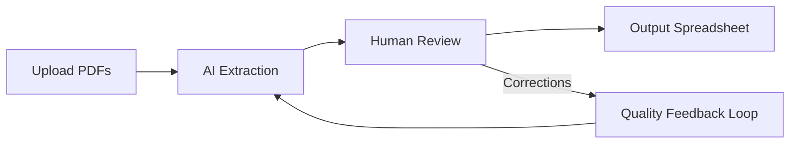
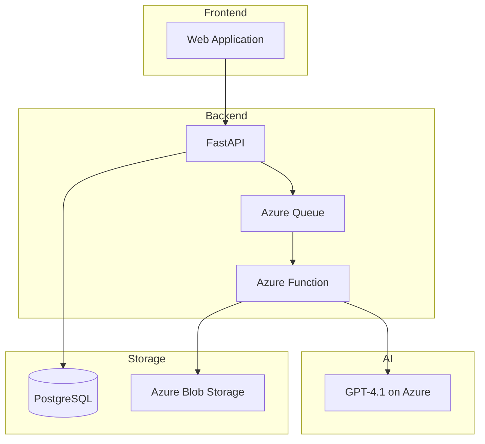
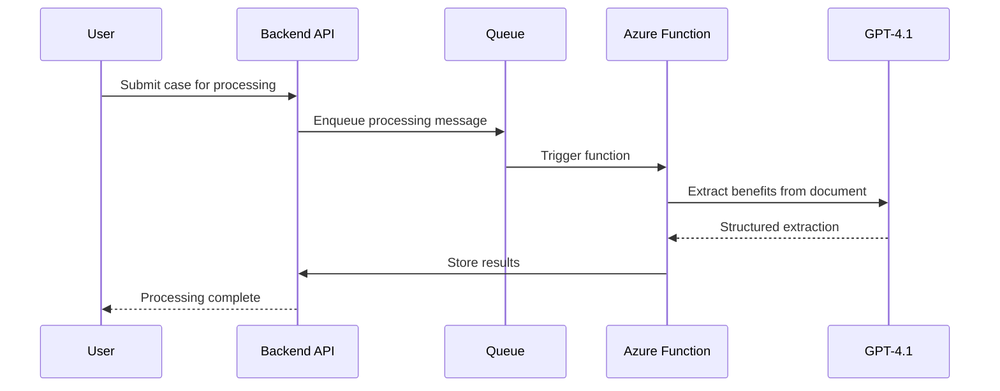
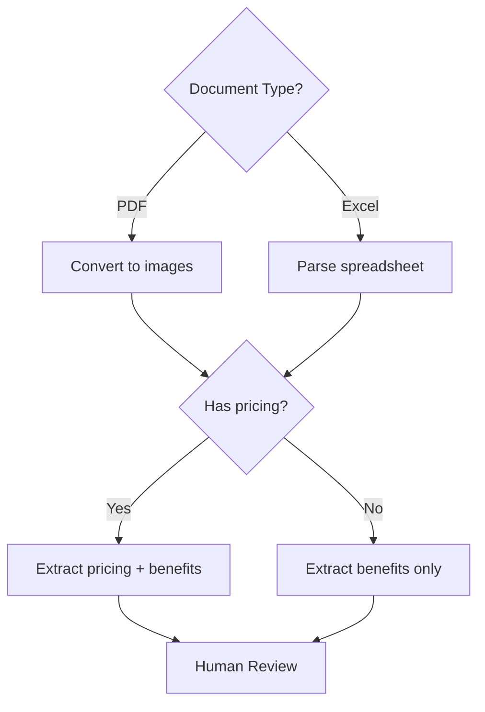

# Visual Pattern Examples

Mermaid diagram patterns and chart generation specs for technical documentation.

## Contents

1. [Mermaid Diagrams](#mermaid-diagrams)
2. [Chart Specs (for generate_chart.py)](#chart-specs)

---

## Mermaid Diagrams

Embed directly in Markdown. Renders on GitHub, GitLab, and Notion.

### Pipeline / Data Flow

Use `graph LR` (left-to-right) for processing pipelines:

````markdown

````

### Architecture Diagram

Use `graph TD` (top-down) for system architecture:

````markdown

````

### Sequence Diagram

Use for request flows showing interactions between components:

````markdown

````

### Decision Tree

Use for branching logic or classification:

````markdown

````

### Tips

- Keep diagrams under 12-15 nodes. Split larger diagrams.
- Label edges (`-->|label|`) when the relationship isn't obvious.
- Use `subgraph` to group related components.
- Use descriptive node names, not abbreviations.

---

## Chart Specs

The `scripts/generate_chart.py` script takes JSON and produces a PNG.

```bash
python scripts/generate_chart.py spec.json --output chart.png
```

### Line Chart — Accuracy Trend

```json
{
    "type": "line",
    "title": "Extraction Accuracy Over 10 Regression Runs",
    "x_label": "Run",
    "y_label": "Accuracy (%)",
    "series": [
        {
            "label": "Accuracy",
            "x": ["R1", "R2", "R3", "R4", "R5", "R6", "R7", "R8", "R9", "R10"],
            "y": [58.3, 68.0, 69.9, 70.9, 71.8, 77.95, 72.87, 77.35, 79.41, 81.14]
        }
    ],
    "target_line": {"value": 80, "label": "80% Target"},
    "value_suffix": "%"
}
```

### Bar Chart — Side-by-Side Comparison

```json
{
    "type": "bar",
    "title": "Per-Carrier Accuracy (Run 9 vs Run 10)",
    "x_label": "Carrier",
    "y_label": "Accuracy (%)",
    "series": [
        {
            "label": "Run 9",
            "x": ["Anthem", "UHC", "Cigna", "Kaiser", "Aetna", "BSC"],
            "y": [76.1, 81.4, 81.7, 88.4, 82.2, 76.7]
        },
        {
            "label": "Run 10",
            "x": ["Anthem", "UHC", "Cigna", "Kaiser", "Aetna", "BSC"],
            "y": [83.1, 86.0, 82.4, 88.4, 78.3, 75.2]
        }
    ],
    "target_line": {"value": 80, "label": "80% Target"},
    "show_values": true,
    "value_suffix": "%"
}
```

### Horizontal Bar — Effort Estimates

```json
{
    "type": "horizontal",
    "title": "Estimated Effort by Area (Days)",
    "x_label": "Days",
    "y_label": "",
    "series": [
        {
            "x": ["Current/Renewal Processing", "Option Processing", "Frontend (Legacy)", "Backend API", "Frontend (V2)"],
            "y": [6.5, 2.5, 1.5, 0.75, 0.25]
        }
    ],
    "single_color": true,
    "value_format": ".1f",
    "value_suffix": " days",
    "width": 9,
    "height": 4
}
```

### Stacked Bar — Error Type Breakdown

```json
{
    "type": "stacked_bar",
    "title": "Correction Types by Carrier",
    "x_label": "Carrier",
    "y_label": "Corrections",
    "series": [
        {"label": "Format errors", "x": ["Anthem", "UHC", "Cigna", "Aetna", "BSC"], "y": [15, 8, 12, 9, 18]},
        {"label": "Value errors", "x": ["Anthem", "UHC", "Cigna", "Aetna", "BSC"], "y": [5, 3, 4, 6, 7]},
        {"label": "Missing fields", "x": ["Anthem", "UHC", "Cigna", "Aetna", "BSC"], "y": [2, 1, 3, 2, 4]}
    ]
}
```

### Common Options

| Option | Type | Default | Description |
|---|---|---|---|
| `width` | number | 10 | Figure width in inches |
| `height` | number | 5 | Figure height in inches |
| `target_line` | object | null | `{"value": 80, "label": "Target"}` — horizontal threshold line |
| `show_values` | bool | false | Display values on bar charts |
| `value_format` | string | ".1f" | Python format spec for values |
| `value_suffix` | string | "" | Suffix for value labels (e.g., "%", " days") |
| `annotate_last` | bool | true | Annotate last data point on line charts |
| `single_color` | bool | false | Use one color for all bars (horizontal charts) |
| `x_rotation` | number | 0 | Rotation angle for x-axis labels |
| `show_legend` | bool | true | Show the legend |
